# GaussDB(for openGauss)数据库实验报告

## 1 GaussDB(for openGauss)数据库创建与维护实验

### 1.1 实验目的

1. 通过对GAUSSDB(FOR OPENGAUSS)数据库创建与访问：

   (1) 了解华为云分布式数据库GAUSSDB(FOR OPENGAUSS)的软件环境和创建方法；
   (2) 掌握并熟悉GAUSSDB(FOR OPENGAUSS)数据库软件的使用方法；
   (3) 掌握并熟悉GAUSSDB(FOR OPENGAUSS)数据库软件的构成和相关工具；
   (4) 通过GAUSSDB(FOR OPENGAUSS)数据库软件的使用，深入理解数据库系统的基本概念。

2. 通过创建GAUSSDB(FOR OPENGAUSS)数据库及进行相应的维护，了解并掌握GaussDB(for openGauss)数据库的创建与维护的不同方法和途径，进而通过这一具体的数据库理解实际数据库所包含的各要素。

### 1.2 实验平台及环境

- 华为云: GaussDB 2.7.2  
- 数据库：PostgreSQL

### 1.3 实验内容

1. GAUSSDB(FOR OPENGAUSS)数据库软件的使用：  
    (1) 登录并运行GAUSSDB(FOR OPENGAUSS)数据库；
    (2) 了解华为云数据库GAUSSDB(FOR OPENGAUSS)的机制；
    (3) 熟悉GAUSSDB(FOR OPENGAUSS)数据库的各项功能。
2. 数据库创建与维护：
    (1) 创建“疫情数据”数据库；
    (2) 对数据库属性和参数进行相应的修改和维护；
    (3) 练习数据库的删除等维护操作。

### 1.4 实验步骤

1. 熟悉GaussDB(for openGauss)数据库的创建过程；
2. 创建一个名为“疫情数据”的数据库；  
3. 删除“疫情数据”数据库。

### 1.5 实验结果及分析

#### 1.5.1 数据库的创建

1. 登录华为云平台，选择IAM用户登录，原华为云账号为`luxqbupt123`,IAM用户名为`bupt+本人学号`,密码为`bupt2024`。
2. 进入控制台后点击数据库，进入数据库管理服务DAS，进入开发工具，环境切换到华南-广州-友好用户环境。
3. 新增数据库实例连接，数据库引擎选择GaussDB，数据库实例选择`gauss-3c93_root_0`，角色为`master`。
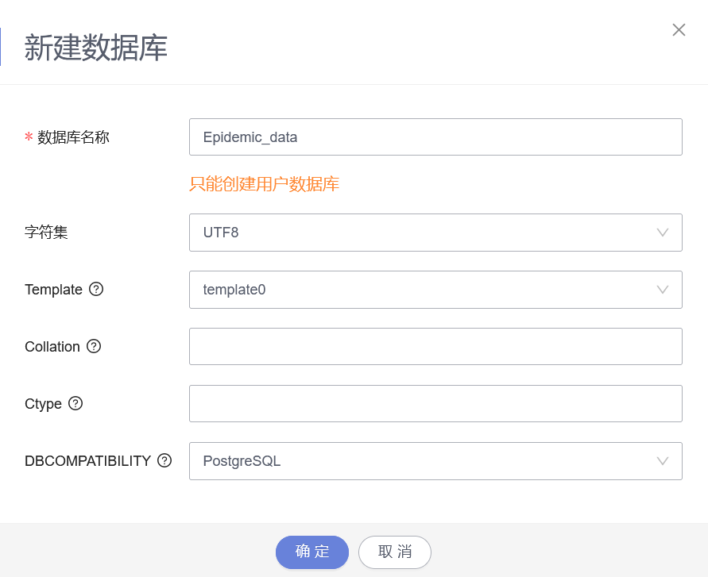
对应的SQL语句为：

```SQL
CREATE DATABASE 疫情数据
```

#### 1.5.2 数据库的删除

删除操作直接点击右侧删除即可。  
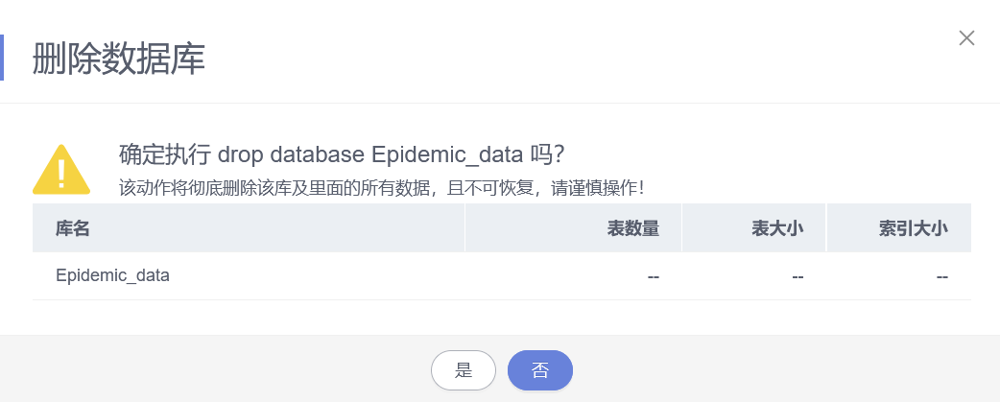
对应SQL语句为：

```SQL
DROP DATABASE 疫情数据
```

删除成功后，数据库`疫情数据`被删除。

### 1.6 实验小结

&emsp;&emsp;本次实验我通过华为云完成了数据库的创建和删除，实现了华为云数据库的使用方法，能通过华为云对数据库进行基本操作，目前没有遇到其他问题。  

## 2 数据库表的创建与维护实验

### 2.1 实验目的

1. 通过进行数据库表的建立操作，熟悉并掌握GAUSSDB(FOR OPENGAUSS)数据库表的建立方法，理解关系型数据库表的结构，巩固PostgreSQL中关于数据库表的建立语句；
2. 通过进行数据库表数据的增加、删除和插入等维护操作，熟悉并掌握GAUSSDB(FOR OPENGAUSS)数据库数据的操作方法，巩固PostgreSQL中关于数据维护的语句。

### 2.2 实验平台及环境

- 华为云: GaussDB 2.7.2  
- 数据库：PostgreSQL

### 2.3 实验内容

建立相应的表并熟悉基本操作，例如建表、对表进行增、删、改、查。

### 2.4 实验步骤

1. 熟悉课程实验背景知识；
2. 使用GAUSSDB(FOR OPENGAUSS)数据库软件创建相应的表；
3. 将提供的数据导入各表，掌握GAUSSDB(FOR OPENGAUSS)数据库数据导入的方法；
    注意：
    (1)表中空列的处理；
    (2)表结构与数据类型的匹配。
4. 修改 “病例基本信息”表数据，增加名为“备注”的列,数据类型为vachar()型；
5. 修改 “病例基本信息”表数据，将 “备注”列的数据类型改为int；
6. 修改 “病例基本信息”表数据，删除“备注”列；
7. 删除“病例基本信息”数据表。

### 2.5 实验过程及分析

#### 数据表的创建和导入

由于各表的创建步骤类似，因此此处只以病例基本信息表的创建和数据导入为例说明，首先执行如下SQL语句建表：

```SQL
CREATE TABLE 病例基本信息 (
    病例号 INT PRIMARY KEY,
    省 VARCHAR(50) NULL,
    市 VARCHAR(50) NULL,
    区 VARCHAR(50) NULL,
    日期 DATE NULL,
    性别 VARCHAR(10) NULL,
    年龄 INT NULL,
    患者信息 VARCHAR(500) NULL,
    其它信息 VARCHAR(500) NULL,
    信息来源 VARCHAR(500) NULL
);
```

建表完成后，点击上侧的导入·导出中的导入，新建任务
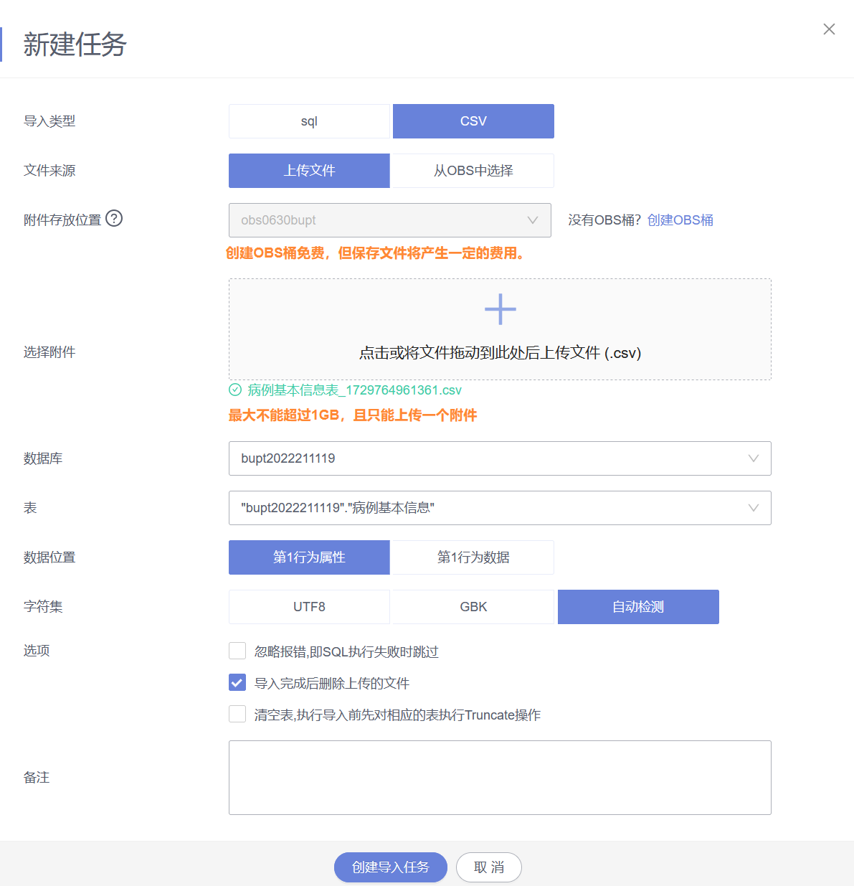
注意，对存在空列的表需要使用excel将空列删除，创建导入任务后等待数据上传完成则数据导入成功。

#### 修改 “病例基本信息”表数据，增加名为“备注”的列,数据类型为vachar()型

执行SQL语句为:

```SQL
ALTER TABLE 病例基本信息 ADD COLUMN 备注 VARCHAR(100)
```

结果如下：

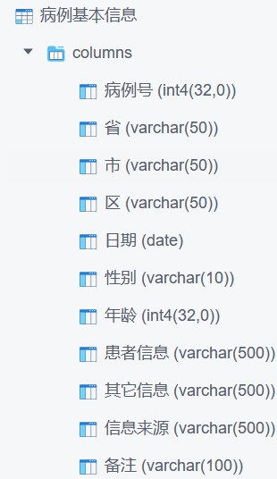

#### 修改 “病例基本信息”表数据，将 “备注”列的数据类型改为int

执行SQL语句为:

```SQL
ALTER TABLE 病例基本信息 ALTER COLUMN 备注 TYPE INT
```

结果如下：

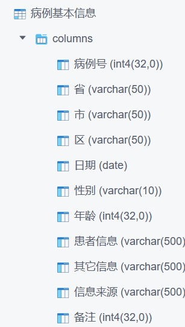

#### 修改 “病例基本信息”表数据，删除“备注”列

执行SQL语句为:

```SQL
ALTER TABLE 病例基本信息 DROP COLUMN 备注;
```

#### 删除“病例基本信息”数据表

执行SQL语句为:

```SQL
DROP TABLE 病例基本信息
```

即可删除成功。

### 2.6 实验总结

&emsp;&emsp;本次实验中第一个遇到的问题是空列的处理，对数据中的空列如果不进行处理的话导入数据时文件格式与表的格式就会不一致导致导入异常，经自己摸索和询问老师，对这种空列直接在excel中删除整列即可，第二个遇到的问题是`varchar`刚开始设置的长度有时会太小导致无法存下所有数据，导致导入异常，增大长度后即可正常导入。  
&emsp;&emsp;在实验中还遇到设置主键和外键导致异常的问题，数据文件中的数据很多，同时不同数据的格式和可靠性也不同，可能有的数据的部分表项为空，所以不能够盲目的去设置主键和外键，需要谨慎考虑。  
&emsp;&emsp;实验让我对基本的SQL建表以及修改表的操作更加熟悉，除上述问题以外没有遇到其他问题，同时希望能够更新一下第一次实验的PPT，PPt中的部分账号和密码已经更换，有一定的误导性。

## 3 数据查询实验

### 3.1 实验目的

&emsp;&emsp;通过对实验二建立的数据库关系表的各种查询的操作，加深对SQL语言和PostgreSQL查询语言的了解，掌握相关查询语句的语法及使用方法。

### 3.2 实验内容

1. 单表查询
    1-1 查询国内确诊病例基本信息的所有信息来源。
    1-2 给出河南省、西藏自治区、台湾省的英文名称和人口数。
    1-3 查询2021年1月20日各省现有确诊病例数据，按现有确诊病例数降序排列输出。
    1-4 顺义区中风险地区的数量。
    1-5 计算截至2021年1月20日全国累计确诊病例数。
    1-6 查询1005号病例确诊后，其所在市新增的所有确诊病例。
    1-7 在“病例基本信息表”中查询石家庄市在2021年1月11日当天以及之前的所有60岁以上的患者信息。
    1-8 统计截止到2020年12月30日美国累计确诊病例数最多的10个州。
    1-9 统计截至2021年1月20号中国发病率最高的人群（人群按照年龄划分，儿童<18，18<=青壮年<60，老年>=60）。
2. 多表查询：
    2-1 借助病例行程信息粗略查询曾去过“源升品质生活坊”的所有患者的基本信息。
    2-2 根据病例行程信息表和病例基本信息表，查询行程信息中存在“家庭聚餐”的病例被确诊的日期。
    2-3 对比中美两国累计确诊病例数，输出格式为(日期，中国累计确诊，美国累计确诊)。
    2-4 计算截止到2021年1月20日，美国有些县的累计确诊是同一个州的其他县的2倍或以上，列出这些县，以及他们所在的州和他们的累计确诊。
    2-5 计算世界上人口数排名前10位的国家地区。
    2-6 列出美国人口超千万的大州中，截至2021年1月20日新冠肺炎疫情死亡率超过2%的州。
    2-7 截至2021年1月20日，河北省哪些区出现了新冠确诊病例但不属于中高风险地区。
    2-8在病例行程信息表的基础上根据病例基本信息表，查询河北省病例的全部信息。
3. 嵌套查询：
    3-1  查询披露的确诊患者信息中年龄最大的患者，输出其基本信息。(未注明年龄的患者不进行比较)。
    3-2  查询2020年12月份新增确诊患者最多的城市。
    3-3  结合“全国各省参考信息表”和“病例基本信息表”给出没有新增确诊病例或未披露病例信息的省份。
    3-4  2021年1月20日全国中高风险地区所在省中，哪些省在1月20日没有新增确诊信息披露。
    3-5  根据病例基本信息表查询一月份国内新增患者病例最多的城市。
    3-6  查询除中美两国以外的其余国家中，进入2021年以来单日新增确诊病例始终不低于一万例的国家。

### 3.3 实验要求

1. 要求学生独立完成以上内容；
2. 按照实验步骤完成实验后，撰写报告内容。

### 3.4 实验结果及分析

#### 1-1 查询国内确诊病例基本信息的所有信息来源

执行SQL语句为:

```SQL
SELECT DISTINCT 信息来源
FROM 病例基本信息 
```

查询结果如下：
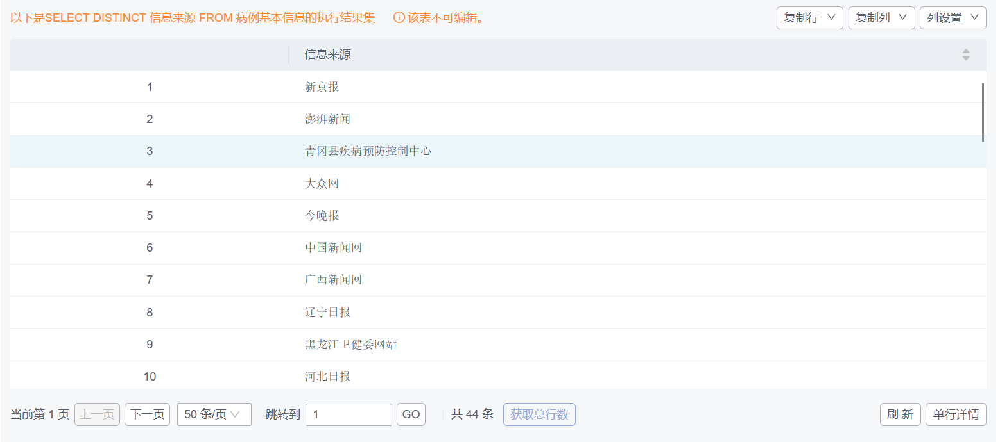

#### 1-2 给出河南省、西藏自治区、台湾省的英文名称和人口数

执行SQL语句为:

```SQL
SELECT 英文名称，人口数
FROM 全国各省参考信息表
WHERE 中文名称 IN ('河南省'，'西藏自治区'，'台湾省')
```

查询结果如下：


#### 1-3 查询2021年1月20日各省现有确诊病例数据，按现有确诊病例数降序排列输出

执行SQL语句为:

```SQL
SELECT 省,累计确诊-累计死亡-累计治愈 AS 现有确诊
from 全国各省累计数据统计表 
WHERE 日期 = '2021-01-20'
ORDER BY 现有确诊 DESC
```

查询结果如下：
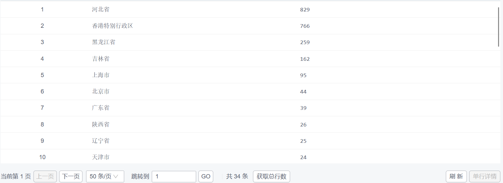

#### 1-4 查询顺义区中风险地区的数量

执行SQL语句为:

```SQL
SELECT COUNT(*)
FROM 全国城市风险等级表 
WHERE 区 = '顺义区' AND 风险等级 = '中风险地区'
```

查询结果如下：


#### 1-5 计算截至2021年1月20日全国累计确诊病例数

执行SQL语句为:

```SQL
SELECT SUM(累计确诊) AS 全国累计确诊
FROM 全国各省累计数据统计表 
WHERE 日期 = '2021-01-20'
```

查询结果如下：


#### 1-6 查询1005号病例确诊后，其所在市新增的所有确诊病例

执行SQL语句为：

```SQL
SELECT *
FROM 病例基本信息 AS T1
WHERE EXISTS (
    SELECT 市 ,日期 
    FROM 病例基本信息 AS T2
    WHERE T2.病例号 = 1005 AND T1.日期 >= T2.日期 AND T1.市 = T2.市
)
```

通过简单的查询操作找到1005号病例所在市和确诊日期，然后再进行查找，查询结果如下：


#### 1-7 在“病例基本信息表”中查询石家庄市在2021年1月11日当天以及之前的所有60岁以上的患者信息

执行SQL语句为：

```SQL
SELECT * 
FROM 病例基本信息 
WHERE 市 = '石家庄市' AND 日期 <= '2021-01-11' AND 年龄 > 60
```

查询结果如下：
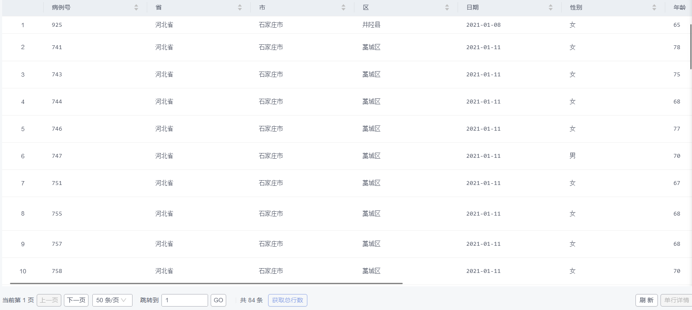

#### 1-8 统计截止到2020年12月30日美国累计确诊病例数最多的10个州

执行SQL语句为：

```SQL
SELECT 州,SUM(累计确诊) AS 州累计确诊
FROM 美国各州县确诊与死亡数统计表 
GROUP BY 州 
ORDER BY 州累计确诊 DESC
LIMIT 10
```

查询结果如下：
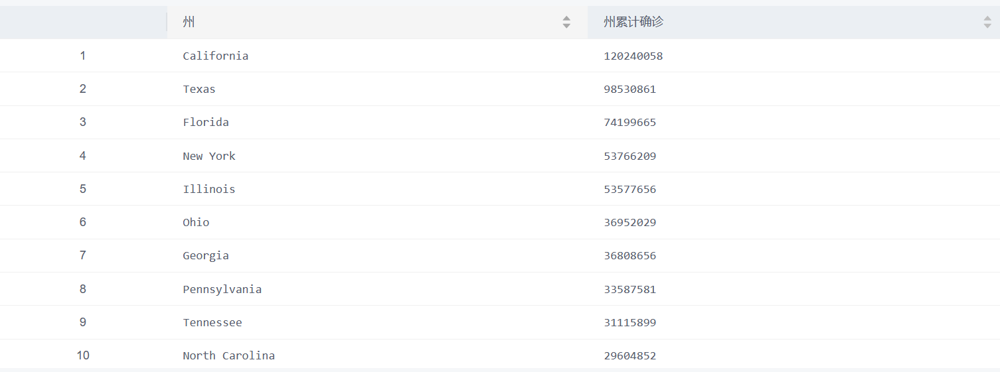

#### 1-9 统计截至2021年1月20号中国发病率最高的人群（人群按照年龄划分，儿童<18，18<=青壮年<60，老年>=60）

执行SQL语句为：

```SQL
SELECT
    CASE 
        WHEN 年龄 < 18 THEN '儿童'
        WHEN 年龄 >= 18 AND 年龄 < 60 THEN '青壮年'
        ELSE '老年'
    END AS 年龄段,
    COUNT(*) AS 发病人数
FROM 病例基本信息
WHERE 日期 <= '2021-01-20'
GROUP BY 
    CASE 
        WHEN 年龄 < 18 THEN '儿童'
        WHEN 年龄 >= 18 AND 年龄 < 60 THEN '青壮年'
        ELSE '老年'
    END
ORDER BY 发病人数 DESC
LIMIT 1;
```

首先将人群按年龄分类并计数，然后利用倒序输出最多发病人数即可，查询结果如下：


#### 2-1 借助病例行程信息粗略查询曾去过“源升品质生活坊”的所有患者的基本信息

执行SQL语句为：

```SQL
SELECT 病例基本信息.*
FROM 病例基本信息 NATURAL JOIN 病例行程信息表 
WHERE 行程信息 LIKE '%源升品质生活坊%' 
```

查询结果如下：
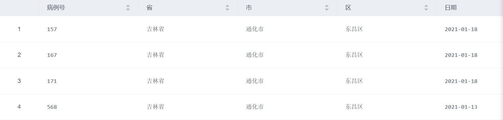

#### 2-2 根据病例行程信息表和病例基本信息表，查询行程信息中存在“家庭聚餐”的病例被确诊的日期

执行SQL语句为：

```SQL
SELECT 病例基本信息.日期
FROM 病例基本信息 NATURAL JOIN 病例行程信息表 
WHERE 行程信息 LIKE '%家庭聚餐%' 
```

查询结果如下：


#### 2-3 对比中美两国累计确诊病例数，输出格式为(日期，中国累计确诊，美国累计确诊)

执行SQL语句为：

```SQL
SELECT 日期,中国累计确诊,美国累计确诊
FROM (
  SELECT 日期,SUM(累计确诊) AS 中国累计确诊
  FROM 全国各省累计数据统计表 
  GROUP BY 日期
) AS 中国确诊
NATURAL JOIN
(
  SELECT 日期,SUM(累计确诊) AS 美国累计确诊
  FROM 美国各州县确诊与死亡数统计表
  GROUP BY 日期
) AS 美国确诊
```

查询结果如下：
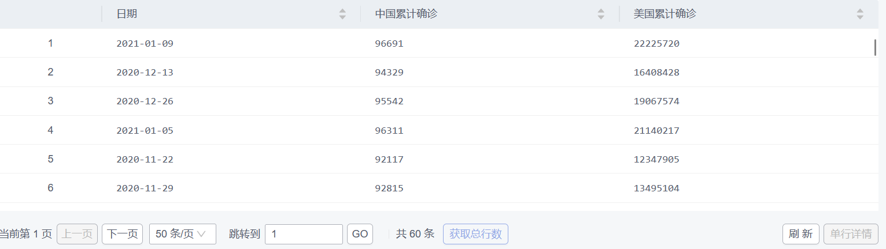

#### 2-4 计算截止到2021年1月20日，美国有些县的累计确诊是同一个州的其他县的2倍或以上，列出这些县，以及他们所在的州和他们的累计确诊

执行SQL语句为：

```SQL
SELECT A.县, A.州, A.累计确诊
FROM 美国各州县确诊与死亡数统计表 AS A
WHERE A.日期 = '2021-01-20'
  AND A.累计确诊 >= 2 * (
    SELECT MAX(B.累计确诊)
    FROM 美国各州县确诊与死亡数统计表 AS B
    WHERE B.州 = A.州
      AND B.县 != A.县
      AND B.日期 = '2021-01-20'
  )
```

查询结果如下：
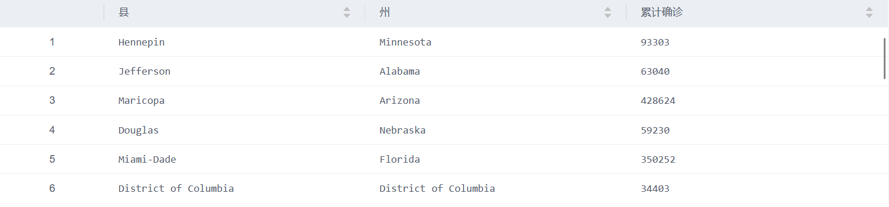

#### 2-5 计算世界上人口数排名前10位的国家地区

执行SQL语句为：

```SQL
SELECT *
FROM (
  SELECT 国家, 人口数
  FROM 参考信息表 
  WHERE 组合码 = 国家 AND 人口数 IS NOT NULL 
)
UNION (
  SELECT 'China' AS 国家, SUM(人口数) AS 人口数
  FROM 全国各省参考信息表 
  WHERE 组合码 LIKE '%, China'
)
ORDER BY 人口数 DESC 
LIMIT 10
```

查询结果如下：
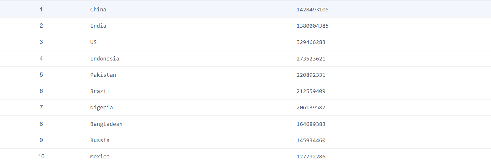

#### 2-6 列出美国人口超千万的大州中，截至2021年1月20日新冠肺炎疫情死亡率超过2%的州

执行SQL语句为：

```SQL
SELECT 州, 州累计死亡/州累计确诊 AS 死亡率
FROM (
  SELECT 州, SUM(累计死亡) AS 州累计死亡, SUM(累计确诊) AS 州累计确诊
  FROM 美国各州县确诊与死亡数统计表 AS T
  WHERE 日期 = '2021-01-20'
  GROUP BY 州
  HAVING 10000000 < (
    SELECT 人口数
    FROM 参考信息表 AS S 
    WHERE T.州 = S.省州 AND S.国家 = 'US' AND S.市县 IS NULL 
  )
)
WHERE 州累计确诊 > 0 ANd 死亡率 > 0.02
```

查询结果如下：


#### 2-7 截至2021年1月20日，河北省哪些区出现了新冠确诊病例但不属于中高风险地区

执行SQL语句为：

```SQL
SELECT 区 
FROM 病例基本信息 
WHERE 日期 <= '2021-01-20' AND 省 = '河北省' AND 区 IS NOT NULL 
EXCEPT 
SELECT DISTINCT 区
FROM 全国城市风险等级表 
WHERE 省 = '河北省'
```

查询结果如下：


#### 2-8 在病例行程信息表的基础上根据病例基本信息表，查询河北省病例的全部信息

执行SQL语句为：

```SQL
SELECT 行程号, 病例号, 年龄, 性别, 患者信息, 日期信息, 行程信息, 其它信息
FROM 病例行程信息表  NATURAL JOIN 病例基本信息 
WHERE 省 = '河北省'
```

查询结果如下：
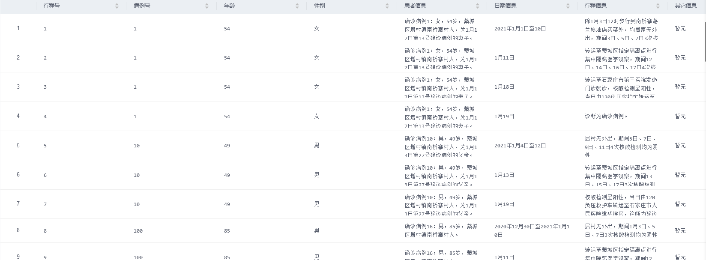

#### 3-1  查询披露的确诊患者信息中年龄最大的患者，输出其基本信息。(未注明年龄的患者不进行比较)

执行SQL语句为：

```SQL
SELECT 性别, 年龄, 患者信息, 其它信息
FROM 病例基本信息 
WHERE 年龄 >= ALL(
  SELECT 年龄
  FROM 病例基本信息 
  WHERE 年龄 IS NOT NULL 
)
```

查询结果如下：


#### 3-2  查询2020年12月份新增确诊患者最多的城市

执行SQL语句为：

```SQL
WITH 十二月各市新增确诊 AS(
  SELECT 市, COUNT(*) AS 病例数
  FROM 病例基本信息
  WHERE 日期 >= '2020-12-01' AND 日期 <= '2020-12-31'
  GROUP BY 市
)
SELECT 市, 病例数
FROM 十二月各市新增确诊
WHERE 病例数 >= ALL (
  SELECT 病例数
  FROM 十二月各市新增确诊
)
```

查询结果如下：


#### 3-3  结合“全国各省参考信息表”和“病例基本信息表”给出没有新增确诊病例或未披露病例信息的省份

执行SQL语句为：

```SQL
SELECT SUBSTRING(中文名称, 1, 2) AS 省份
FROM 全国各省参考信息表  
EXCEPT (
    SELECT DISTINCT SUBSTRING(省, 1, 2)
    FROM 病例基本信息
)
```

由于两张表中有如`广西壮族自治区`和`广西省`，`新疆维吾尔族自治区`和`新疆维吾尔自治区`这样的差别，所以在筛选的时候只选择前两个字进行匹配
查询结果如下：


#### 3-4  2021年1月20日全国中高风险地区所在省中，哪些省在1月20日没有新增确诊信息披露

执行SQL语句为：

```SQL
SELECT DISTINCT 省 AS 省份
FROM 全国城市风险等级表  
EXCEPT (
  SELECT DISTINCT 省
  FROM 病例基本信息 
  WHERE 日期 = '2021-01-20'
)
```

查询结果如下：


#### 3-5  根据病例基本信息表查询一月份国内新增患者病例最多的城市

执行SQL语句为：

```SQL
WITH 一月各市确诊 AS (
  SELECT 市, COUNT(*) AS 病例数
  FROM 病例基本信息 
  WHERE 日期 >= '2021-01-01' AND 日期 <= '2021-01-31'
  GROUP BY 市 
)
SELECT 市, 病例数
FROM 一月各市确诊
WHERE 病例数 >= ALL(
  SELECT 病例数
  FROM 一月各市确诊
 )
```

查询结果如下：


#### 3-6  查询除中美两国以外的其余国家中，进入2021年以来单日新增确诊病例始终不低于一万例的国家

执行SQL语句为：

```SQL
WITH 其余国家 AS (
  SELECT 日期, 国家, SUM(累计确诊) AS 国家累计确诊
  FROM 各国疫情数据统计表 AS S
  WHERE 日期 >= '2021-01-01' AND 国家 NOT IN ('US','China') AND NOT EXISTS (
    SELECT 国家 
    FROM 各国疫情数据统计表 AS T
    WHERE S.国家 = T.国家 AND T.省州 IS NULL 
  )
  GROUP BY 日期, 国家 
  UNION 
  SELECT 日期 ,国家 ,累计确诊 
  FROM 各国疫情数据统计表
  WHERE 日期 >= '2021-01-01' AND 国家 NOT IN ('US','China') AND 省州 IS NULL 
),
每日新增确诊 AS (
  SELECT A.日期, A.国家, A.国家累计确诊 - COALESCE(B.国家累计确诊, 0) AS 新增确诊
  FROM 其余国家 AS A
  JOIN 其余国家 AS B 
  ON A.国家 = B.国家 AND A.日期 = B.日期 + INTERVAL '1 day'
)
SELECT 国家
FROM 每日新增确诊
GROUP BY 国家
HAVING MIN(新增确诊) >= 10000;
```

&emsp;&emsp;本题较为复杂，首先各国疫情数据表中有的直接给出了国家每日累计确诊数，有的给的是各州的，需要分别统计并结合为其余国家，然后再通过后一天的累计确诊数减去前一天的累计确诊数计算为每日新增确诊数，再查找大于一万的
查询结果如下：


### 3.5 实验总结

&emsp;&emsp;在实验中，主要会遇到一些如使用`''`括起字符串，子查询连接时未申明别名的问题，在对多表查询以及嵌套查询中，需要进行一定的规划和思考来找到需要的数据，这些步骤使上课理论与实验实践相结合，加深了我对课程内容的理解和学习，也使我对SQL语法更加熟悉，平时上课没有注意到的细节也在实验中暴露出问题，并对我的错误观念进行了纠正，在这次实验中我受益匪浅。


```sql
SELECT 
	市,
    COUNT(CASE WHEN 风险等级 = '中风险地区' THEN 1 END) AS 中风险地区数目,
    COUNT(CASE WHEN 风险等级 = '高风险地区' THEN 1 END) AS 高风险地区数目
FROM 全国城市风险等级表
WHERE 市 = '石家庄市'
GROUP BY 市


WITH 各个城市 AS (SELECT 
	市,
    COUNT(CASE WHEN 风险等级 = '中风险地区' THEN 1 END) AS 中风险地区数目,
    COUNT(CASE WHEN 风险等级 = '高风险地区' THEN 1 END) AS 高风险地区数目
FROM 全国城市风险等级表
GROUP BY 市)
SELECT 市, 中风险地区数目, 高风险地区数目
FROM 各个城市
WHERE 中风险地区数目 >= 2 AND 高风险地区数目 >= 2


SELECT A.县, A.州, A.累计确诊
FROM 美国各州县确诊与死亡数统计表 AS A
WHERE A.日期 = '2021-01-20'
  AND A.累计确诊 >= 2 * (
    SELECT AVG(B.累计确诊)
    FROM 美国各州县确诊与死亡数统计表 AS B
    WHERE B.州 = A.州
      AND B.县 != A.县
      AND B.日期 = '2021-01-20'
  )


```


